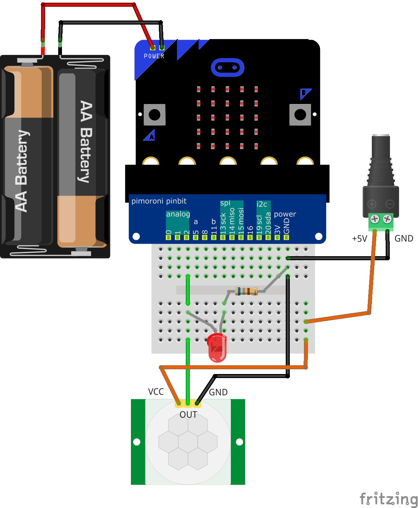
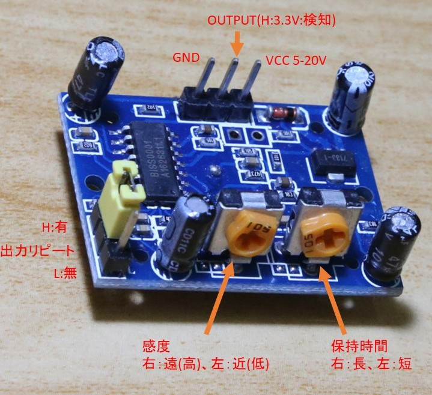

# HC-SR501(人感センサーモジュール)

## 回路図

## コード

[GPIO0](../readme.md#GPIO0)で動きます。

## モジュールのピン説明図

* 最初の動作確認は、以下の設定が確認しやすいようです。
  * ジャンパーはH位置(信号保持時間内に再検知すると出力を続ける)
  * 感度は中ぐらい
  * 保持時間は最短
  * 出力にLEDを付ける(回路図参照)
* 5V以上の電源が必要なためmicro:bitの3V端子では動きません
* 基板上の端子名は表面のレンズを外すと印刷があります
* 電源投入後 初期化に1分ほどかかります。(下記データシート参照)

## その他の情報

* データシート: [https://www.mpja.com/download/31227sc.pdf](https://www.mpja.com/download/31227sc.pdf)
* aitendoのページ : [https://www.aitendo.com/product/10254
](https://www.aitendo.com/product/10254)
* 解説ページ: [http://www.umek.topaz.ne.jp/mameduino/pir_howto/](http://www.umek.topaz.ne.jp/mameduino/pir_howto/)