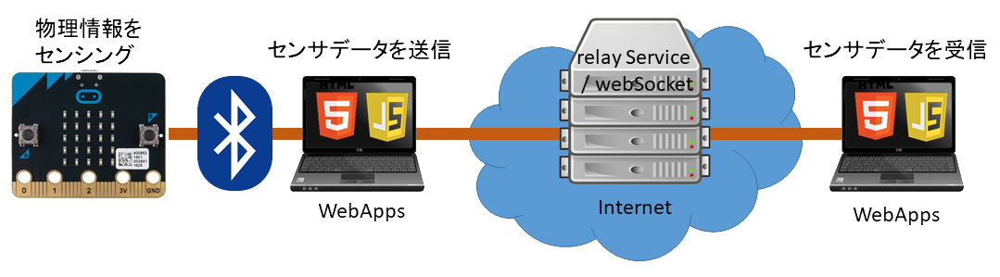

# Examples 
回路図はリンク先htmlに掲載

## GPIO

|`LIVE`Example  |説明  |ソースコード|
|:---|:---|:---|
| <a href="GPIO1/index.html" target="_blank">GPIO1</a> | Hello Real World (Lチカ) | [GitHub](https://github.com/chirimen-oh/chirimen-micro-bit/blob/master/examples/GPIO1/) |
| <a href="GPIO0/index.html" target="_blank">GPIO0</a> | タクトスイッチに反応して画面表示| [GitHub](https://github.com/chirimen-oh/chirimen-micro-bit/blob/master/examples/GPIO0) |
| <a href="GPIO2/index.html" target="_blank">GPIO2</a> | タクトスイッチに反応してLEDが点灯 | [GitHub](https://github.com/chirimen-oh/chirimen-micro-bit/blob/master/examples/GPIO2/) |
| [CMMB_GPIO_example3.png](../imgs/CMMB_GPIO_example3.png) | タクトスイッチに反応してモーター動作(回路図のみ。コードは上と同じ) |- |

## I2C
micro:bitのI2C端子はpin19(SCL)とpin20(SDA)です。

|`LIVE`Example  |説明  |ソースコード|
|:---|:---|:---|
| <a href="I2C1_ADT7410/index.html" target="_blank">I2C1_ADT7410</a> | ADT7410 温度センサー | [GitHub](https://github.com/chirimen-oh/chirimen-micro-bit/blob/master/examples/I2C1_ADT7410/) |
| <a href="I2C1b_ADT7410/index.html" target="_blank">I2C1b_ADT7410</a> | ADT7410 温度センサー(ドライバ使わずに) | [GitHub](https://github.com/chirimen-oh/chirimen-micro-bit/blob/master/examples/I2C1b_ADT7410/) |
| <a href="I2C2_BMP280/index.html" target="_blank">I2C2_BMP280</a> | BMP280 気圧・温度センサー | [GitHub](https://github.com/chirimen-oh/chirimen-micro-bit/blob/master/examples/I2C2_BMP280/) |
| <a href="I2C3_VL53L0X/index.html" target="_blank">I2C3_VL53L0X</a> | VL53L0X レーザー距離センサー | [GitHub](https://github.com/chirimen-oh/chirimen-micro-bit/blob/master/examples/I2C3_VL53L0X/) |
| <a href="I2C4_S11059/index.html" target="_blank">I2C4_S11059</a> |  S11059 色センサー | [GitHub](https://github.com/chirimen-oh/chirimen-micro-bit/blob/master/examples/I2C4_S11059/) |
| <a href="I2C5_NEOPIXEL/index.html" target="_blank">I2C5_NEOPIXEL</a> |  [NEOPIXEL I2C](https://gist.github.com/satakagi/608f6c2c963c8e9453864f11b6fb1f3d#file-readme-md)  | [GitHub](https://github.com/chirimen-oh/chirimen-micro-bit/blob/master/examples/I2C5_NEOPIXEL/) |
| <a href="I2C6_BME280/index.html" target="_blank">I2C6_BME280</a> |  BME280 気圧・温度・湿度センサー  | [GitHub](https://github.com/chirimen-oh/chirimen-micro-bit/blob/master/examples/I2C6_BME280/) |
| <a href="I2C7_SHT30/index.html" target="_blank">I2C7_SHT30</a> |  SHT30 温度・湿度センサー  | [GitHub](https://github.com/chirimen-oh/chirimen-micro-bit/blob/master/examples/I2C7_SHT30/) |
| <a href="I2C7_PCA9680/index.html" target="_blank">I2C8_PCA9680</a> |  PCA9680 サーボコントロール  | [GitHub](https://github.com/chirimen-oh/chirimen-micro-bit/blob/master/examples/I2C8_PCA9680/) |

 

- <a href="i2cdetect/index.html" target="_blank">I2Cデバイスをリストアップするツール (i2cdetect.html)</a>

## 内蔵デバイス

|`LIVE`Example  |説明  |ソースコード|
|:---|:---|:---|
| <a href="Embed/index.html" target="_blank">Embed</a> |  内蔵デバイス(LED, 加速度, 磁気, 温度, 明るさ, スイッチAB) | [GitHub](https://github.com/chirimen-oh/chirimen-micro-bit/blob/master/examples/Embed/) |

 

- [拡張API解説](../guidebooks/extendedFunctions.html#内蔵デバイスの利用機能)

## 拡張GPIO

|`LIVE`Example  |説明  |ソースコード|
|:---|:---|:---|
| <a href="GPIO_EXT0/index.html" target="_blank">GPIO_EXT0</a> |  アナログ出力 (LEDが緩やかに明滅) | [GitHub](https://github.com/chirimen-oh/chirimen-micro-bit/blob/master/examples/GPIO_EXT0/) |
| <a href="GPIO_EXT1/index.html" target="_blank">GPIO_EXT1</a> |  アナログ入力 | [GitHub](https://github.com/chirimen-oh/chirimen-micro-bit/blob/master/examples/GPIO_EXT1/) |
| <a href="GPIO_EXT1b/index.html" target="_blank">GPIO_EXT1b</a> |  アナログ入力(onchange) | [GitHub](https://github.com/chirimen-oh/chirimen-micro-bit/blob/master/examples/GPIO_EXT1b/) |

 

- [拡張API解説](../guidebooks/extendedFunctions.html#gpioの拡張機能)

## リモートコントロール ([RelayServer.js](https://chirimen.org/remote-connection/)を使います)

システム構成イメージは以下の通りです

まずPC-sideのwebAppsを開きます。次にmicro:bit-sideを開きます。　その後、micro:bit-sideのwebAppsでmicro-bitを接続すると、二つのwebApps間で遠隔制御が実行されます。動作確認であれば両方のwebAppsをひとつのPCで開いても動きます。もちろんそれぞれを別々の場所のPCで開いても動きます。

|`LIVE`Example  PC-side | micro:bit-side |説明  |ソースコード|
|:---|:---|:---|:---|
| <a href="remote_example1/pc.html" target="_blank">PC-side</a> | <a href="remote_example1/mbit.html" target="_blank2">micro:bit-side</a> | 内蔵センサーの値を配信 | [GitHub](https://github.com/chirimen-oh/chirimen-micro-bit/blob/master/examples/remote_example1/) |
| <a href="remote_example2/pc.html" target="_blank">PC-side</a> | <a href="remote_example2/mbit.html" target="_blank2">micro:bit-side</a> | 内蔵センサーの値をPC側からリクエスト | [GitHub](https://github.com/chirimen-oh/chirimen-micro-bit/blob/master/examples/remote_example2/) |
| <a href="remote_example3/pc.html" target="_blank">PC-side</a> | <a href="remote_example3/mbit.html" target="_blank2">micro:bit-side</a> | LEDにメッセージを表示 | [GitHub](https://github.com/chirimen-oh/chirimen-micro-bit/blob/master/examples/remote_example3/) |
| <a href="remote_example4/pc.html" target="_blank">PC-side</a> | <a href="remote_example4/mbit.html" target="_blank2">micro:bit-side</a> | GPIOに繋いだLEDをPCから点灯 | [GitHub](https://github.com/chirimen-oh/chirimen-micro-bit/blob/master/examples/remote_example4/) |
| <a href="remote_example5/pc.html" target="_blank">PC-side</a> | <a href="remote_example5/mbit.html" target="_blank2">micro:bit-side</a> | I2C温度湿度センサSHT30の値をPC側からリクエスト | [GitHub](https://github.com/chirimen-oh/chirimen-micro-bit/blob/master/examples/remote_example5/) |
