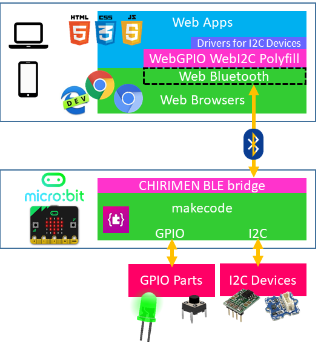

## CHIRIMEN with micro:bitのシステム構成

- Web Apps
   - CHIRIMEN with micro:bit環境の開発者はこのWeb Appsを開発します
- WebGPIO WebI2C Polyfill
   - WebGPIO WebI2C API、およびmicro:bit内蔵デバイスを操作するためのAPIのポリフィル実装
   - Web Bluetoothを用いて、micro:bitと通信を行う
   - ソースコード: [microBitBLE.js](../polyfill/microBitBLE.js)
   - URL: [https://chirimen.org/chirimen-micro-bit/polyfill/microBitBLE.js](https://chirimen.org/chirimen-micro-bit/polyfill/microBitBLE.js)
- CHIRIMEN BLE brigde
   - WebGPIO WebI2C Polyfillと連携して、micro:bitのGPIO, I2C, 内蔵デバイスを制御するサポートプログラム
   - Bluetoothを用いて、ウェブブラウザと通信を行う
   - ソースコード: [このディレクトリの内容](https://github.com/chirimen-oh/chirimen-micro-bit/tree/master/micro-bit)
   - インストール:  <a href="link2original.html#https://makecode.microbit.org/_chw6fvg6KW2m" target="_blank">https://makecode.microbit.org/_chw6fvg6KW2m</a>
