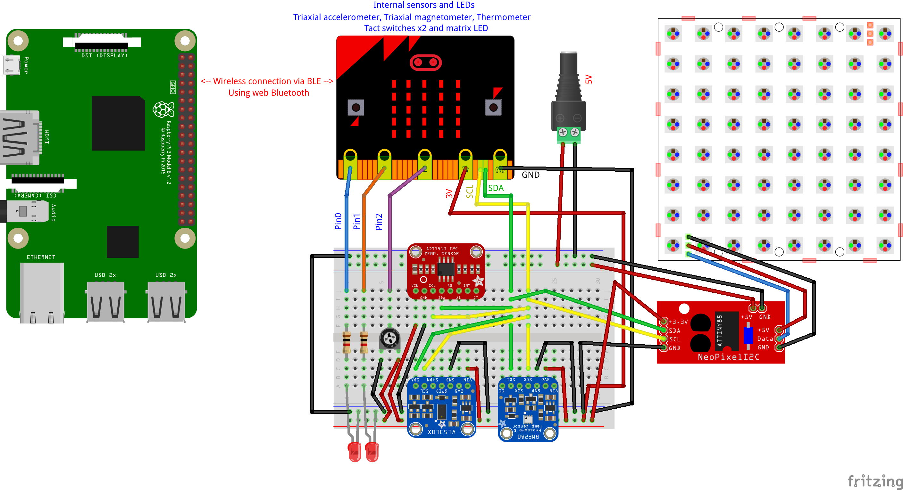

# CHIRIMEN with micro:bit implementation tests

## Test code for CHIRIMEN with micro:bit

For I2C test, copy [i2c-NEOPIXEL.js](https://chirimen.org/chirimen-raspi3/gc/contrib/drivers/i2c-NEOPIXEL_I2C.js), [i2c-BMP280.js](https://chirimen.org/chirimen-raspi3/gc/contrib/drivers/i2c-BMP280.js) and [i2c-VL53L0X.js](https://chirimen.org/chirimen-raspi3/gc/contrib/drivers/i2c-VL53L0X.js).

## Test circuit for test code

